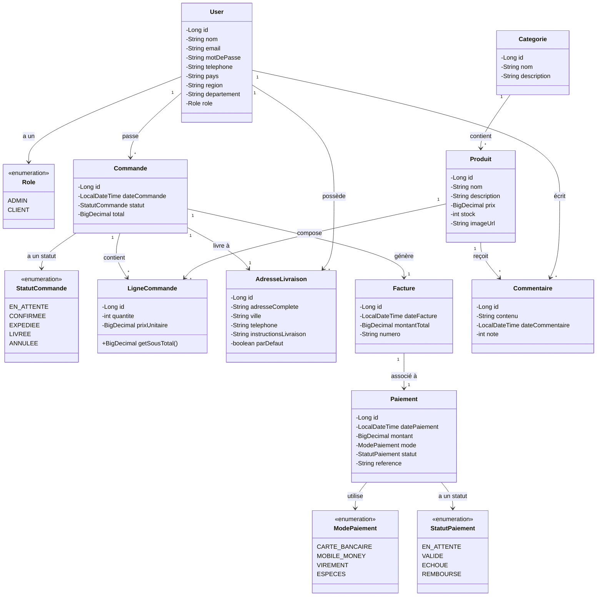

# Diagramme de Classe - Backend E-Commerce

## Architecture des Entités

## 📋 Description des Relations

### **User (Utilisateur)**
- Un utilisateur peut passer **plusieurs commandes** (1-N)
- Un utilisateur peut avoir **plusieurs adresses de livraison** (1-N)
- Un utilisateur peut écrire **plusieurs commentaires** sur des produits (1-N)
- Un utilisateur possède **un rôle** (ADMIN ou CLIENT)

### **Produit**
- Un produit appartient à **une catégorie** (N-1)
- Un produit peut recevoir **plusieurs commentaires** (1-N)
- Un produit peut apparaître dans **plusieurs lignes de commande** (1-N)

### **Catégorie**
- Une catégorie peut contenir **plusieurs produits** (1-N)

### **Commande**
- Une commande appartient à **un utilisateur** (N-1)
- Une commande contient **plusieurs lignes de commande** (1-N)
- Une commande est livrée à **une adresse de livraison** (N-1)
- Une commande génère **une facture** (1-1)

### **LigneCommande**
- Une ligne de commande appartient à **une commande** (N-1)
- Une ligne de commande référence **un produit** (N-1)
- Méthode calculée : `getSousTotal()` = prix unitaire × quantité

### **AdresseLivraison**
- Une adresse de livraison appartient à **un utilisateur** (N-1)
- Une adresse peut être utilisée pour **plusieurs commandes** (1-N)

### **Facture**
- Une facture est liée à **une commande** (1-1)
- Une facture possède **un paiement** (1-1)

### **Paiement**
- Un paiement est associé à **une facture** (1-1)
- Un paiement utilise **un mode de paiement** (enumération)
- Un paiement a **un statut** (enumération)

### **Commentaire**
- Un commentaire est écrit par **un utilisateur** (N-1)
- Un commentaire concerne **un produit** (N-1)
- Note : entre 1 et 5 étoiles

## 🔐 Énumérations

### Role
- `ADMIN` : Administrateur avec privilèges complets
- `CLIENT` : Client standard

### StatutCommande
- `EN_ATTENTE` : Commande créée, en attente de validation
- `CONFIRMEE` : Commande validée
- `EXPEDIEE` : Commande expédiée
- `LIVREE` : Commande livrée au client
- `ANNULEE` : Commande annulée

### ModePaiement
- `CARTE_BANCAIRE` : Paiement par carte bancaire
- `MOBILE_MONEY` : Paiement par mobile money (Orange Money, Wave, etc.)
- `VIREMENT` : Virement bancaire
- `ESPECES` : Paiement en espèces à la livraison

### StatutPaiement
- `EN_ATTENTE` : Paiement en attente
- `VALIDE` : Paiement validé et encaissé
- `ECHOUE` : Échec du paiement
- `REMBOURSE` : Paiement remboursé

## 🏗️ Architecture Technique

- **ORM** : JPA/Hibernate
- **Base de données** : Relations gérées via annotations JPA
- **Validation** : Bean Validation (Jakarta Validation)
- **Sérialisation** : Jackson avec gestion des cycles via `@JsonIdentityInfo`

//bonjour